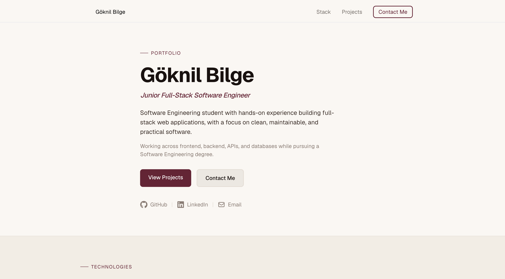

# 👤 Portfolio Website

Personal portfolio site showcasing my projects, tech stack, and contact info — built as a single-page site with Next.js.

🔗 **[Live Site](https://www.goknilbilge.dev/)**

---

## ✨ Features

- Single-page layout with a sticky navbar and smooth-scroll section links (Stack, Projects, Contact)
- Project cards with tech tags, live demo link, and GitHub link for each project
- Tech stack organized by category (Frontend, Backend, Database, Tools)
- Contact section with GitHub, LinkedIn, and email links
- All external links (social, project repos, live demos) are pulled from environment variables instead of being hardcoded in components
- Responsive layout that adapts across mobile and larger screens

---

## 🛠️ Technologies

- **Framework:** Next.js 16 (App Router), React 19, TypeScript
- **Styling:** Tailwind CSS 4
- **Icons:** react-icons

---

## 📸 Preview



---

## 🚀 Getting Started

### Prerequisites
- Node.js 18+

### Installation

```bash
git clone https://github.com/ItsLxst/portfolio-website
cd portfolio-website
npm install
```

Create a `.env.local` file in the root:

```
NEXT_PUBLIC_GITHUB_URL=
NEXT_PUBLIC_LINKEDIN_URL=
NEXT_PUBLIC_EMAIL=

NEXT_PUBLIC_SPENDSYNC_GITHUB=
NEXT_PUBLIC_SPENDSYNC_LIVE=

NEXT_PUBLIC_DEVSHELF_GITHUB=
NEXT_PUBLIC_DEVSHELF_LIVE=

NEXT_PUBLIC_VOTEFLOW_GITHUB=
NEXT_PUBLIC_VOTEFLOW_LIVE=

NEXT_PUBLIC_INVOICEFORGE_GITHUB=
NEXT_PUBLIC_INVOICEFORGE_LIVE=
```

Run the dev server:

```bash
npm run dev
```

Open `http://localhost:3000` in your browser.

---

## 📚 What I Learned

- Composing a full page from independent section components (`Hero`, `TechStack`, `Projects`, `Contact`, `Footer`)
- Managing personal and project links through environment variables rather than hardcoding them across multiple components
- Keeping a consistent design system (color palette, spacing, typography) across sections with Tailwind

---

## 🔮 Future Improvements

- [ ] Add screenshots/preview images to each project card
- [ ] Add a downloadable CV/resume link
- [ ] Add subtle scroll-triggered animations
- [ ] Add a dark mode toggle
